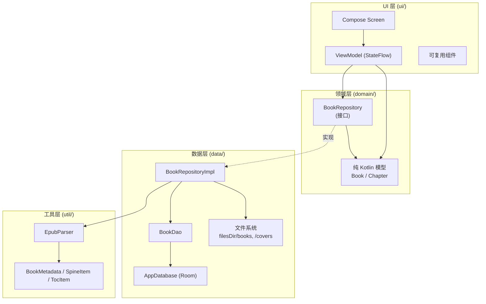
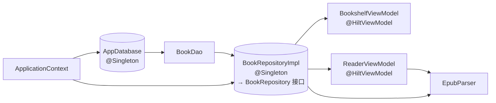
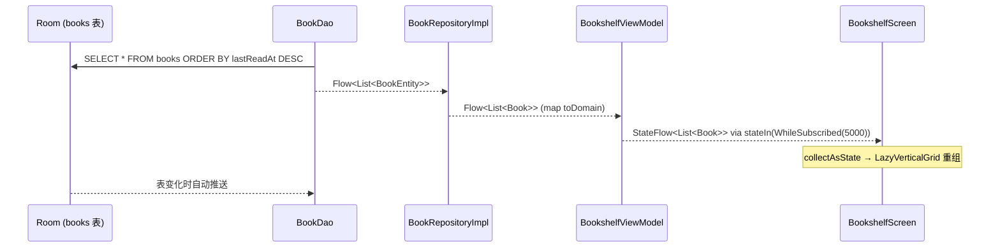
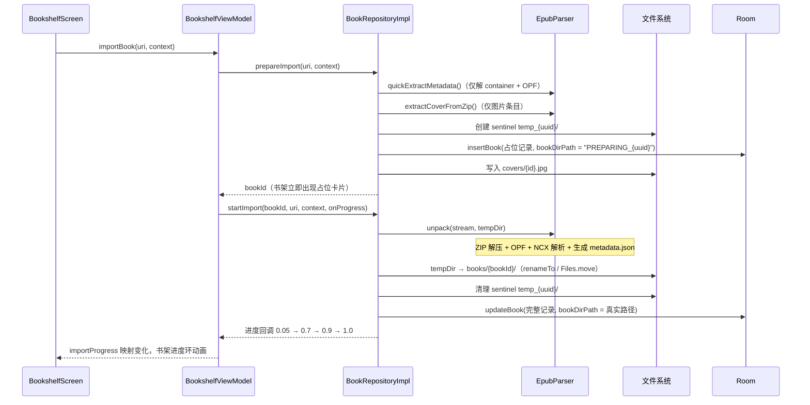
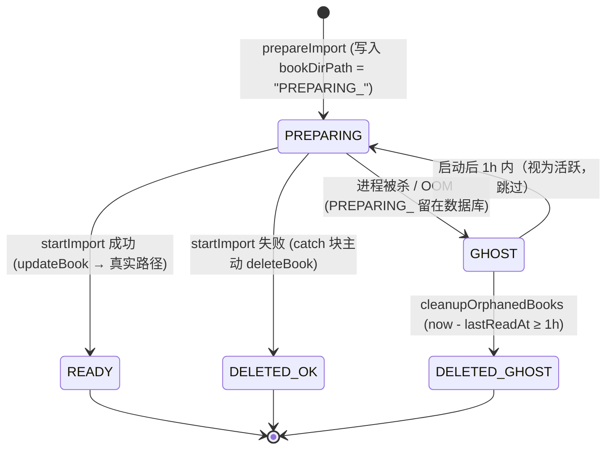
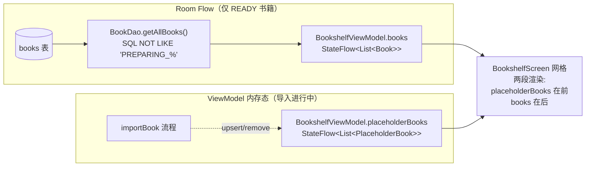
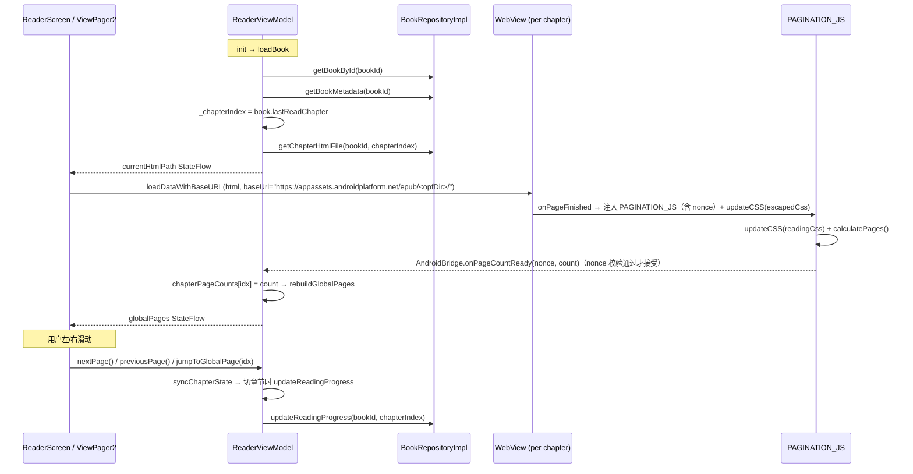
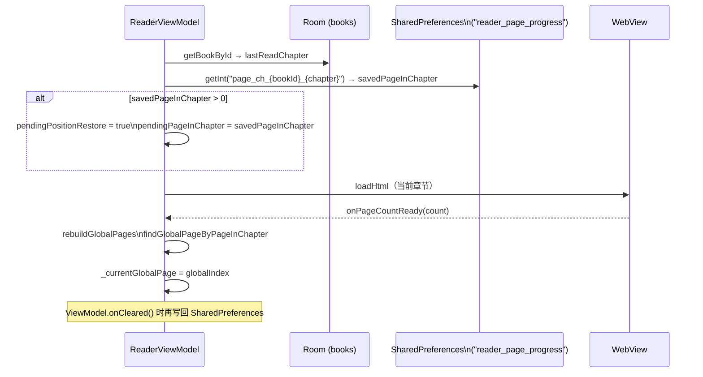
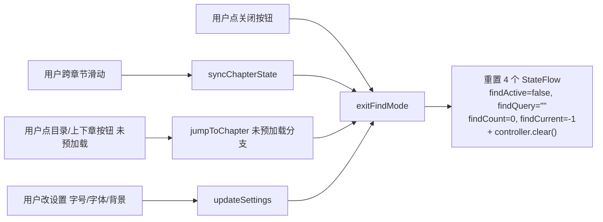

# 架构详解

本文档面向需要理解 Read 整体设计的工程师，涵盖分层、模块职责、数据流以及关键设计取舍。

---

## 目录

- [设计目标](#设计目标)
- [分层架构](#分层架构)
- [模块职责](#模块职责)
- [依赖关系](#依赖关系)
- [核心数据流](#核心数据流)
- [WebView 安全模型](#webview-安全模型)
- [WebView 内存管理](#webview-内存管理)
- [章节内搜索](#章节内搜索)
- [全书搜索](#全书搜索)
- [协程取消约定](#协程取消约定)
- [关键设计决策](#关键设计决策)
- [线程模型](#线程模型)

---

## 设计目标

1. **本地优先 / 零网络依赖**：所有书籍数据驻留在 app 内部存储，无需网络权限。
2. **保留排版还原度**：直接渲染 EPUB 原始 HTML/CSS，而不是将正文拍平成纯文本。
3. **MVVM + Repository**：UI 与数据完全解耦，方便单元测试与未来替换数据源。
4. **响应式数据流**：Room Flow → ViewModel StateFlow → Compose 自动重组，删/改/导入后 UI 即时刷新。
5. **依赖倒置**：ViewModel 只依赖 `BookRepository` 接口，不直接接触 Room / 文件系统。

---

## 分层架构



ASCII 版（兼容不支持 Mermaid 的预览器）：

```
┌─────────────────────────────────────────────────────────┐
│  UI 层 (ui/)                                            │
│  Compose Screen ──> ViewModel ──> StateFlow             │
├─────────────────────────────────────────────────────────┤
│  领域层 (domain/)                                       │
│  纯 Kotlin 模型 (Book, Chapter)                         │
│  BookRepository 接口                                    │
├─────────────────────────────────────────────────────────┤
│  数据层 (data/)                                         │
│  BookRepositoryImpl ──┬─> BookDao ──> AppDatabase       │
│                       └─> 文件系统 (filesDir/...)         │
├─────────────────────────────────────────────────────────┤
│  工具层 (util/)                                         │
│  EpubParser + EpubUnpackResult                          │
└─────────────────────────────────────────────────────────┘
```

---

## 模块职责

### `com.example.read`（应用根包）

- `ReadApplication.kt`：`@HiltAndroidApp`，Hilt 代码生成入口。
- `MainActivity.kt`：`@AndroidEntryPoint`，唯一 Activity，启用 `enableEdgeToEdge()` 并装载 `ReadNavHost`。

### `data/local`

| 文件 | 职责 |
|------|------|
| `AppDatabase.kt:18` | Room 数据库定义，当前 `version = 2`，包含 `books` 表 |
| `Migrations.kt:19` | `MIGRATION_1_2`：把 `filePath` 列重建为 `bookDirPath` |
| `entity/BookEntity.kt:18` | `books` 表实体 + `toDomain()` / `toEntity()` 扩展函数 |
| `dao/BookDao.kt:20` | `getAllBooks()` 返回 Flow，其余写操作为 `suspend` |

### `data/repository`

- `BookRepositoryImpl.kt:22`：实现 `BookRepository`，统一协调 `BookDao`、文件系统与 `EpubParser`。
  - 导入采用两阶段：`prepareImport` 快速元数据占位，`startImport` 后台完整解包。
  - 章节按需读取（不预存数据库）：`getChapterHtmlFile` 返回 `File`，WebView 直接 `file://` 加载。
  - 启动时 `cleanupOrphanedBooks` 清理 `bookDirPath` 为空的孤立记录。

### `domain`

- `model/Book.kt:17`、`model/Chapter.kt:14`：纯 Kotlin `data class`，不依赖 Android 框架。
- `repository/BookRepository.kt:22`：接口契约，方法签名只暴露领域模型 + `BookMetadata` + `File`。
  - 注：当前 `importBook` / `prepareImport` / `startImport` 仍带 `Uri` 与 `Context` 参数（详见 [README 路线图](../README.md#路线图)）。

### `di`

- `AppModule.kt:31`：`@InstallIn(SingletonComponent::class)` 提供：
  - `AppDatabase`（单例，注册 `MIGRATION_1_2`）
  - `BookDao`（由数据库获取）
  - `BookRepository`（单例，绑定到 `BookRepositoryImpl`）

### `ui/bookshelf`

- `BookshelfScreen.kt`：2 列 `LazyVerticalGrid` + FAB + AlertDialog + Snackbar。
- `BookshelfViewModel.kt:30`：`books` StateFlow 来自 `repository.getAllBooks().stateIn(WhileSubscribed(5000))`；`importBook` 串联 `prepareImport` + `startImport`，进度通过 `_importProgress` 映射 `bookId -> 0~1`。

### `ui/reader`

| 文件 | 职责 |
|------|------|
| `ReaderScreen.kt` | 顶栏/底栏动画、目录 ModalBottomSheet、ViewPager2 + PagedChapterAdapter |
| `ReaderViewModel.kt:38` | `globalPages` / `chapterPageCounts` / `currentGlobalPage` 等核心状态 |
| `ChapterWebViewFactory.kt:22` | 创建并配置 WebView，注入 CSS + 分页 JS |
| `WebViewPaginator.kt:24` | `PAGINATION_JS` 常量 + `PaginationBridge` `@JavascriptInterface` |
| `ReadingSettings.kt:19` | 设置数据类 + `toReaderCss()` + `ReadingSettingsManager`（SharedPreferences） |
| `ReadingSettingsDialog.kt` | 底部弹出面板：滑块/按钮组 |
| `PageCurlPageTransformer.kt` | ViewPager2 PageTransformer，仿真卷曲翻页 |
| `PageInfo.kt:17` | 全局页面 = (`chapterIndex`, `pageInChapter`) |
| `TextSplitter.kt` | 旧版基于 `StaticLayout` 的分页工具，保留兼容（当前主线路使用 WebView 分页） |

### `ui/navigation`

- `NavGraph.kt`：`@Serializable data object Bookshelf` 与 `@Serializable data class Reader(val bookId: Long)`，通过 `composable<Reader>` + `backStackEntry.toRoute<Reader>()` 提取参数。

### `ui/theme`、`ui/components`

- `theme/`：Material 3 主题（动态取色 + 棕色系静态色板 + Serif 排版）。
- `components/BookCard.kt`、`components/EmptyState.kt`：可复用组件。

### `util`

- `EpubParser.kt:43`：纯 Jsoup XML 解析器，提供 `unpack()` / `quickExtractMetadata()` / `extractCoverFromZip()` 三个公开方法。
- `EpubUnpackResult.kt`：`EpubUnpackResult` / `BookMetadata` / `SpineItem` / `TocItem`（后三者 `@Serializable`，写入 `metadata.json`）。

---

## 依赖关系



- `AppDatabase` 与 `BookRepository` 标 `@Singleton`，确保全应用唯一实例。
- `BookDao` 由 Database 实例提供，不单独标注作用域。
- ViewModel 通过构造函数注入 `BookRepository` 接口。

---

## 核心数据流

### 1. 书架展示与响应式更新



### 2. EPUB 两阶段导入



**占位记录的 `PREPARING_{uuid}` 前缀**（P0-5）及"幽灵清理"扩展（P1-1）：

- 第一阶段 `prepareImport` 在 `insertBook` 时把 `bookDirPath` 写为 `"PREPARING_${uuid}"`（见 `BookRepositoryImpl.kt:121`），而不是空字符串。
- 第二阶段 `startImport` 成功后会把 `bookDirPath` 改写为真实绝对路径，并同时删除对应的 `temp_{uuid}/` sentinel 目录；任意失败路径都会显式删除 sentinel + 占位记录。
- P1-1 在 P0-5 之上叠加两层防御：
  - **UI 路径**：`BookDao.getAllBooks()` 在 SQL 中加 `WHERE bookDirPath NOT LIKE 'PREPARING_%'` 过滤（`BookDao.kt:38`），书架订阅的 Flow 永远不会看到中间态占位卡片。
  - **清理路径**：`cleanupOrphanedBooks` 改走新方法 `BookDao.getAllBooksIncludingPreparing()`（`BookDao.kt:46`）拿全量记录，对 `lastReadAt` 距今 ≥ `PREPARING_GHOST_THRESHOLD_MS` (1 小时，`BookRepositoryImpl.kt:311`) 的 `PREPARING_` 记录主动 `deleteBook`，防止进程崩溃后留下永久幽灵书。

P1-1 占位记录状态转换：



`getAllBooks` 与 `getAllBooksIncludingPreparing` 的二分（P1-1）：

| DAO 方法 | 调用者 | 是否包含 PREPARING_ | 用途 |
|----------|--------|---------------------|------|
| `getAllBooks()` | `BookRepositoryImpl.getAllBooks` → `BookshelfViewModel.books` | 否（SQL `NOT LIKE 'PREPARING_%'`） | 书架订阅，永远只看到 READY 状态的书 |
| `getAllBooksIncludingPreparing()` | `BookRepositoryImpl.cleanupOrphanedBooks` | 是 | 启动期扫描全量，配合时间阈值识别幽灵 |

### UI 层书架渲染：`books` 与 `placeholderBooks` 双 StateFlow 合并（P1-NEW-1）

P1-1 在 SQL 层过滤 `PREPARING_*` 后，`BookshelfViewModel.books` flow 不再发射占位记录，但用户在导入大文件时仍需要看到进度环。P1-NEW-1 修复在 ViewModel 层引入第二条独立通道：



- `_placeholderBooks: MutableStateFlow<List<PlaceholderBook>>`（`BookshelfViewModel.kt:97`）：进入 `importBook` 的 try 块时 `upsertPlaceholder(placeholderId, progress = 0.05f)`，进度回调内 `upsertPlaceholder(...).copy(progress = ...)`，无论成功 / 失败都在 finally 等价点 `removePlaceholder(placeholderId)`。
- 与 Room 的 `bookDirPath = "PREPARING_*"` 是**两套互不影响的视图**：Room 中的 PREPARING 记录服务于 `cleanupOrphanedBooks` 启动清理（业务上"是否存在占位记录"由 DB 当唯一真源），`placeholderBooks` 服务于 UI 进度环（业务上"是否要画占位卡"由 ViewModel 内存态决定）。两者通过 `placeholderId` 串联但不共享存储。
- `BookshelfScreen` 在 `LazyVerticalGrid` 内分两段 `items(...)` 渲染：`items(placeholderBooks, key = { "placeholder_${it.id}" })` 在前，`items(books, key = { it.id })` 在后；空状态判定改为 `books.isEmpty() && placeholderBooks.isEmpty()`。前缀字符串 key 避免与真实 `book.id`（Long）的 LazyGrid 内部 hash 冲突。

失败处理：

- 任意阶段异常时清理 `temp_{uuid}/` 临时目录。
- `startImport` 阶段失败时同时回滚占位数据库记录（`BookRepositoryImpl.kt:189-194`）。
- `BookshelfViewModel.importBook` 的 catch 中再做一次幂等兜底（B8，`BookshelfViewModel.kt:93-97`）。
- 启动时 `cleanupOrphanedBooks` 删除：(a) `bookDirPath` 为空字符串的记录；(b) `PREPARING_` 前缀且 `lastReadAt` 距今 ≥ 1 小时的幽灵记录。活跃 `PREPARING_` 记录（< 1h）一律跳过，交给 `startImport` 自身的成功/失败路径处理。

### 3. 阅读器章节切换 / 翻页



### 4. 阅读进度恢复



设置变更时也会复用同一套恢复路径：`updateSettings` 清空 `chapterPageCounts` / `globalPages` 并同步把 `_currentGlobalPage` 重置为 0（B2 修复，见 `ReaderViewModel.kt:456`），标记 `pendingPositionRestore = true`，等 WebView 重新计算页数后按章内页码定位。

---

## WebView 安全模型

阅读器渲染 EPUB 章节使用 Android WebView。EPUB 内联 HTML/CSS/JS 不可信（来自外部文件），WebView 必须做防御性配置，否则恶意 EPUB 可能读取应用私有文件甚至触发 RCE。本节描述 2026-05-24 P0-3 / P0-4 修复落地的安全模型。

### 为什么从 `file://` 切换到 `WebViewAssetLoader`

旧实现使用 `loadDataWithBaseURL(html, baseUrl = "file://${bookDirPath}/${opfDir}/", ...)` 并打开 `setAllowFileAccess(true)`。该方案有两个固有风险：

1. **私有文件读取**：EPUB 内联 JS 通过 `fetch("file:///data/data/com.example.read/databases/read.db")` 之类的请求，可在 WebView 中读到应用沙盒内任意文件。
2. **同源策略对 `file://` 不友好**：不同浏览器内核对 `file:` origin 的实现有差异，历史上多次出现 file scheme 跨域漏洞。

新方案：

- 在 `ChapterWebViewFactory.kt:60` 显式关闭 `allowFileAccess` / `allowContentAccess` / `allowFileAccessFromFileURLs` / `allowUniversalAccessFromFileURLs`，并把 `mixedContentMode` 设为 `NEVER_ALLOW`。
- 通过 `androidx.webkit.WebViewAssetLoader.InternalStoragePathHandler` 把书籍解包目录 `filesDir/books/{id}/` 映射到固定 host：

  ```
  https://appassets.androidplatform.net/epub/<相对路径>
  ```

- `loadDataWithBaseURL` 的 `baseUrl` 改为 `https://appassets.androidplatform.net/epub/<opfDir>/`，EPUB 内部 `<link href="style.css">` / `` 等相对路径会被 `shouldInterceptRequest` 截获并从内部存储读取（`ChapterWebViewFactory.kt:140-152`）。
- `shouldInterceptRequest` 对非 `appassets.androidplatform.net` host 一律返回空响应；`shouldOverrideUrlLoading` 拒绝跨域导航。EPUB 中若引用外链图片 / 字体会无法加载，但 EPUB 标准本就不依赖外联，这是可接受的代价。

### `AndroidBridge` 的 nonce 校验流程

`PAGINATION_JS` 在 WebView 内调用 `window.AndroidBridge.onPageCountReady(...)` 把页数回传给 Kotlin。如果不做来源校验，EPUB 内联脚本可直接拿到 `window.AndroidBridge` 调用同名方法伪造页数。

修复后的流程（`WebViewPaginator.kt` + `ChapterWebViewFactory.kt`）：

1. `ChapterWebViewFactory.loadHtml` 每次加载先 `removeJavascriptInterface("AndroidBridge")`，然后通过 `WebViewPaginator.newNonce()` 生成 16 字节随机 hex 作为本次会话 nonce。
2. `PAGINATION_JS_TEMPLATE` 内有占位符 `__NONCE__`，在注入前用 `replace("__NONCE__", nonce)` 替换；这样 JS 端调用回调时第一个参数是该 nonce。
3. Kotlin 侧 `PaginationBridge` 构造时绑定 `expectedNonce`，`onPageCountReady(nonce, count)` 先比对 `nonce == expectedNonce`，不匹配静默丢弃（`WebViewPaginator.kt:184-191`）。
4. EPUB 内联脚本既无法读到本次 nonce（在 IIFE 闭包中），也无法预测下一次 nonce（SecureRandom），因此即使能触达 `window.AndroidBridge` 也无法伪造合法回调。

### `setAllowFileAccess(false)` 的影响

- **EPUB 内不能再写 `` 之类的 file scheme**：原本就不在 EPUB 规范允许范围内，没有兼容性损失。
- **`evaluateJavascript` 不受影响**：JS 注入走 WebView 控制通道，与 file scheme 无关。
- **资源加载全部经 `WebViewAssetLoader`**：`InternalStoragePathHandler` 要求 base 目录必须是应用内部存储的子路径，对于 `filesDir/books/{id}/` 形态满足；如果未来书籍存放位置改到 `Context.getExternalFilesDir(...)`，需要改用 `WebViewAssetLoader.AssetsPathHandler` 或自定义 handler。

### WebView 加载防御（P1-2）

`WebViewAssetLoader.InternalStoragePathHandler` 的构造期会强制校验：传入的 `directory` 必须位于 `context.getDataDir()` 子目录内，否则抛 `IllegalArgumentException`。阅读器开屏时存在两种"路径未就绪"的合法状态会触发此 IAE：

1. `ReaderScreen.getBookDirPath()` 在 `book` 还没从 Repository 加载完毕时返回 `""`。
2. 用户从书架进入一本仍在导入流程中的占位记录（`bookDirPath = "PREPARING_<uuid>"`）。虽然 P1-1 已让书架不再展示占位卡片，但深链接 / 外部启动入口仍可能直接传 `bookId`。

P1-2 通过 **入口短路 + adapter 兜底** 两层防御消除主线程崩溃：

- **`loadHtml` 入口三态校验**（`ChapterWebViewFactory.kt:121-157`）：
  - `bookDirPath.isEmpty()` 或 `bookDirPath.startsWith("PREPARING_")` → `Log.w("ChapterWebViewFactory", ...)` + `onPageCountReady(1)` 直接返回。
  - `bookDirPath` 指向不存在 / 非目录的路径（外部删除场景） → 同样短路。
  - 通过校验后才走 `removeJavascriptInterface` → `newNonce` → `buildAssetLoader` → `loadDataWithBaseURL` 的正常路径。
- **Adapter try-catch 兜底**（`ReaderScreen.kt:686-723`）：`PagedChapterAdapter.getOrCreateWebView` 在 `mainHandler.post { webViewFactory.loadHtml(...) }` 外包裹 `try { ... } catch (IllegalArgumentException) { ... } catch (Throwable) { ... }`，任一异常都 `webView.loadUrl("about:blank")` + `onPageCountReady(chapterIndex, 1)`，并 `Log.w("PagedChapterAdapter", ...)`。这是对未来 WebViewAssetLoader 在新版本 / 新设备上对其他路径抛异常的预防性兜底。

**失败时 `loadUrl("about:blank")` 不释放 nonce 的考虑**：兜底分支选择只清空 WebView DOM，不调 `removeJavascriptInterface(BRIDGE_NAME)`。原因：本次注入早在 `loadHtml` 内部失败发生在 `addJavascriptInterface` 之前（PREPARING_ 短路在 `removeJavascriptInterface` 之前就 return），`PaginationBridge` 还是上一次成功加载留下的；保留旧 bridge 不会触发回调（旧 WebView 已经 `about:blank`，没有 JS 调用 `AndroidBridge`），下一次合法 `loadHtml` 进来时会先 `removeJavascriptInterface` 再以新 nonce 重注册，nonce 校验语义不受影响。如果未来要彻底清理可在 `loadUrl("about:blank")` 之后追加一次 `removeJavascriptInterface(BRIDGE_NAME)`，但当前无必要。

---

## WebView 内存管理

EPUB 一本书可能有 30~100 章，每章都需要一个 WebView 实例。WebView 是重量级原生组件（一个实例占 ~10-30MB），全部驻留内存会导致 OOM。本节描述 2026-05-24 P0-2 落地的内存控制策略。

### `WebViewLruCache` 容量 = 3 的取舍

`ReaderScreen.kt:518` 新增的 `WebViewLruCache` 基于 `LinkedHashMap(accessOrder=true)`：

- **窗口大小 3**：当前章 + 前一章 + 后一章，恰好覆盖 `preloadAdjacentChapters` 的预加载范围。再大无收益（用户一般顺序翻页），再小则跨章节翻页会触发频繁创建/销毁，体验抖动。
- **淘汰策略**：`removeEldestEntry` 中先 `removeJavascriptInterface("AndroidBridge")` 解绑 JS 桥（释放 ViewModel 闭包引用）→ `loadUrl("about:blank")` 清空 DOM → 从父布局摘除 → `destroy()` 释放原生资源。顺序不可调换，否则会泄漏渲染进程或抛 `IllegalStateException`。
- **线程要求**：所有方法必须在主线程调用（WebView 仅能在创建它的线程操作）。

### `updateSettings` 触发全销毁重建的原因

用户调字号 / 行高 / 字体 / 背景色后，DOM 已经基于旧 CSS 渲染过；理论上只需要再次 `evaluateJavascript("updateCSS(...)")` 就能更新样式。但实际上：

- 旧 WebView 中存在已计算的 `scrollHeight` / 渲染层结构，新 CSS 触发 reflow 时偶发抖动甚至错乱。
- 不同章节缓存的页数是基于旧设置的，重用会导致 `globalPages` 计算出错位的页码。

因此 `ReaderScreen` 中 `LaunchedEffect(readingSettings)` 监听到设置变化时调用 `webViewCache.clear()` 把当前缓存的 WebView 全部销毁，让 `PagedChapterAdapter` 在下次 bind 时按新设置重新创建 WebView 并重新分页。`ReaderViewModel.updateSettings` 同步清空 `chapterPageCounts` / `globalPages` / `_currentGlobalPage` 并标记 `pendingPositionRestore = true`，等 WebView 重新回调 `onPageCountReady` 时按章内页码恢复阅读位置。

### `preloadAdjacentChapters` 5 秒超时 fallback

预加载相邻章节时会创建一个临时 WebView 计算页数后销毁（`ReaderViewModel.preloadChapterPageCount`，`ReaderViewModel.kt:405`）。如果 EPUB 章节异常导致 JS 不回调（如 `<script>` 抛错卡死），临时 WebView 会永久泄漏。

修复方案（B6）：

```kotlin
var disposed = false
val timeoutRunnable = Runnable {
    if (!disposed) {
        disposed = true
        try { webView.destroy() } catch (_: Throwable) {}
    }
}
mainHandler.postDelayed(timeoutRunnable, 5_000L)
factory.loadHtml(...) { pageCount ->
    mainHandler.post {
        if (!disposed) {
            disposed = true
            mainHandler.removeCallbacks(timeoutRunnable)
            // ... 更新 chapterPageCounts ...
            try { webView.destroy() } catch (_: Throwable) {}
        }
    }
}
```

正常回调路径会 `removeCallbacks(timeoutRunnable)` 取消超时；如果 5 秒内没有回调，超时 runnable 强制销毁。`disposed` 标志避免双重 `destroy()`。

### `applicationContext` 而非 Activity Context

`ChapterWebViewFactory(context)` 与 `preloadChapterPageCount` 内创建的 WebView 都改用 `application` 作为 Context（`ReaderScreen.kt:112`、`ReaderViewModel.kt:406`）。原因：

- 预加载的 WebView 可能在 Activity 销毁后才回调（特别是设置变更或快速返回的情况），如果持有 Activity Context 会阻止 Activity 被 GC，导致泄漏整个 Activity 实例（数十 MB）。
- `applicationContext` 与进程同生命周期，无泄漏风险。

> 警告：用 `applicationContext` 创建 WebView 在某些 OEM 设备上会丢失系统主题（如 `?attr/colorPrimary`），但本项目 WebView 仅渲染 EPUB 自带 CSS，不依赖系统主题色，因此可接受。

---

## 章节内搜索

v4 主线新增的 find-in-page 能力。用户在阅读器顶栏点击 🔍 按钮，顶栏切换为搜索栏（输入框 + `x / y` 计数 + 上下导航 + 关闭按钮），输入关键词后实时在当前章节内查找并高亮所有匹配项；上下箭头在匹配项之间循环跳转。

### 数据流（顶层）

```mermaid
sequenceDiagram
  participant UI as FindInPageBar (Compose)
  participant VM as ReaderViewModel
  participant Ctrl as FindInPageController
  participant WV as WebView (当前章节)
  participant JS as window.ReaderFind

  Note over UI: 用户输入关键词
  UI->>VM: updateFindQuery(query)
  VM->>VM: _findQuery.value = query (UI 立即回显)
  VM->>Ctrl: find(query, onResult)
  Ctrl->>WV: evaluateJavascript("window.ReaderFind.find(\"...\")")
  WV->>JS: TreeWalker 遍历文本节点
  JS->>JS: 用 <mark class="reader-find"> 重写匹配文本节点
  JS->>JS: navigate(0) 选中第一个 + scrollIntoView
  JS-->>WV: return matches.length
  WV-->>Ctrl: ValueCallback("12") (主线程)
  Ctrl-->>VM: onResult(12)
  VM->>VM: _findCount.value = 12; _findCurrent.value = 0
  VM-->>UI: collectAsState 触发重组 → 显示 "1 / 12"

  Note over UI: 用户点击下一项
  UI->>VM: findNext()
  VM->>Ctrl: next(onResult)
  Ctrl->>WV: evaluateJavascript("window.ReaderFind.next()")
  JS->>JS: 旧选中 -> removeClass; 新选中 -> addClass + scrollIntoView
  JS->>JS: pageOfMatch(target) 通过 getBoundingClientRect 计算 pageInChapter
  JS-->>Ctrl: return JSON.stringify({index, page})  (v5 升级)
  Ctrl-->>VM: onResult(NavigateResult(index, pageInChapter))
  VM->>VM: _findCurrent.value = newIndex → UI "2 / 12"
  VM->>VM: onFindMatchLocated(pageInChapter) → 写 _currentGlobalPage
  VM-->>UI: ReaderScreen.AndroidView.update 观察到 currentGlobalPage 变化 → viewPager.setCurrentItem
```

### 控制器生命周期

`FindInPageController` 是一个轻量对象，构造时接收一个 `WebView` 引用（`FindInPageController.kt:34`），通过 `evaluateJavascript` 调用 `window.ReaderFind` 暴露的 `find / next / prev / clear / count / current` 函数。所有状态（matches 数组、currentIndex）都封装在 JS 侧 IIFE 闭包内，Kotlin 端无状态。

注入与替换：

- **注入点**：`ReaderScreen` 在 `OnPageChangeCallback.onPageSelected`（`ReaderScreen.kt:383`）与 `onChapterHtmlLoaded` 的 PagedChapterAdapter 回调（`ReaderScreen.kt:360`）两处都会把当前 WebView 包装为 `FindInPageController(wv)` 后调用 `viewModel.attachFindController(...)`；后者保证 JS 已注入完毕，是更稳妥的注入点。
- **替换语义**：`attachFindController`（`ReaderViewModel.kt:662`）先 `currentFindController?.clear()` 清掉旧 WebView 上的残留高亮，再用新 controller 替换；若用户仍处于 find 模式（`findActive.value && findQuery.value.isNotEmpty()`），自动对新章节重发 query，让新章节也高亮。
- **不暴露为 StateFlow**：controller 包含 WebView 引用，纳入 StateFlow 会延长生命周期、引入不必要的引用持有；改为 `var currentFindController: FindInPageController?`，UI 层只通过 ViewModel 的 `findNext / findPrev / updateFindQuery / exitFindMode` 调用。

### JS 注入时机

`FIND_IN_PAGE_JS` 由 `ChapterWebViewFactory.loadHtml` 的 `onPageFinished` 回调注入（`ChapterWebViewFactory.kt:198-202`），顺序如下：

```
1. PAGINATION_JS_TEMPLATE.replace("__NONCE__", nonce)  -- 测量分页 + AndroidBridge 桥
2. FindInPageJs.FIND_IN_PAGE_JS                        -- 注册 window.ReaderFind  (v4 新增)
3. updateCSS(escapedCss)                               -- 含 mark.reader-find / .reader-find-current
4. calculatePages()                                    -- 触发 AndroidBridge 回调
```

CSS 由 `ReadingSettings.toReaderCss()` 在末尾拼接 `FIND_IN_PAGE_CSS`（`ReadingSettings.kt:134`），确保每次 `updateCSS` 都会同步注入 mark 高亮样式 —— 主题切换（白 / 护眼 / 暗黑）后高亮颜色仍生效，不会因为字号 / 字体 / 行高变更被丢失。

颜色选择（详见 `FindInPageJs.kt:151-166` 注释）：

| 用途 | 颜色 | 备注 |
|------|------|------|
| 普通匹配 `mark.reader-find` | `#FFE066`（柔和黄） | 三种主题背景均有足够对比度 |
| 当前选中 `mark.reader-find-current` | `#FF9933`（橙） | 比普通匹配更醒目，配合 `scrollIntoView` |

`color: inherit` 让 mark 内文字继承正文颜色，避免暗黑主题下浏览器默认 mark 字色（黑色）造成低对比。

### 自动退出搜索模式的触发点



三处自动退出的 ViewModel 代码位置：`syncChapterState`（`ReaderViewModel.kt:307`）、`jumpToChapter` 未预加载分支（`ReaderViewModel.kt:426`）、`updateSettings`（`ReaderViewModel.kt:547`）。

设计取舍：跨章节 / 设置变更后，WebView 实例会被销毁或被 LRU 淘汰，旧 controller 中的 WebView 引用悬空，继续调用会 no-op 或抛异常。统一在 ViewModel 内重置状态比让 UI 层各自感知更可靠。

### 与既有安全模型的关系

- **零新增 JS 桥**：FindInPage 仅通过 `evaluateJavascript` 的 `ValueCallback` 取结果（`FindInPageController.kt:53/64/75/88`），不调用 `addJavascriptInterface`，因此与 nonce 校验机制完全解耦，攻击面无新增。
- **关键词转义**：用户输入经 `escapeJsString`（`JsEscaping.kt:30` → `WebViewPaginator.escapeJsString`）转义，防止恶意关键词通过引号 / 反斜杠 / U+2028 截断 JS 字符串字面量。
- **正则元字符转义**：JS 端 `query.replace(/[.*+?^${...}]/g, '\\$&')` 二次防御（`FindInPageJs.kt:68`），避免用户输入 `.*` 等触发非预期的正则行为。
- **`evaluateJavascript` 失败兜底**：`parseIntOrZero`（`FindInPageController.kt:105`）对 `null` / `"null"` / 非数字字符串都返回 `defaultValue`，确保上层不会因 NumberFormatException 崩溃。

### 已知限制

1. **章内 only**：搜索范围限定在当前章节 HTML 内。跨章节滑动 / 跳转目录会自动清除高亮和退出搜索模式。
   v5 已新增独立的"全书搜索"作用域（详见 [全书搜索](#全书搜索) 小节），与章内搜索通过顶栏 toggle 切换。
2. **跨内联元素文本不匹配**：TreeWalker 按文本节点遍历，`a<em>b</em>c` 在 DOM 层是三个独立文本节点，正则 `regex.test(node.nodeValue)` 只能在单个文本节点内匹配，因此无法跨内联元素匹配整体字符串。如要支持需要先把章节正文拍平为一个临时字符串再做位置反查，复杂度显著上升，留待未来。
3. **`scrollIntoView` 联动 ViewPager2 翻页**（v5 已修复，旧版"已知限制"撤销）：v4 旧实现下
   JS 端 `target.scrollIntoView({block: 'center'})` 仅让 mark 进入 WebView 内部视窗，但 ViewPager2
   的全局页码与匹配项的章内位置不联动 —— 匹配项位于章内第 2+ 页时高亮看不见。v5 P1-v5-2
   修复后，`navigate(delta)` 返回 JSON `{index, page}`（`FindInPageJs.kt:155-179`），
   `FindInPageController.parseNavigateResult` 解析为 `NavigateResult` 后由
   `ReaderViewModel.onFindMatchLocated`（`ReaderViewModel.kt:859`）把章内页码转为全局页码并写入
   `_currentGlobalPage`，ReaderScreen 的 `AndroidView.update` 观察到变化后调
   `viewPager.setCurrentItem(targetGlobal, false)`，自动翻到匹配所在的全局页。
   注意：`find()` 首次定位（用户刚输入完）不联动翻页，按"下一个"才触发。
4. **不支持正则 / 大小写选项**：当前固定大小写不敏感、按字面量匹配。
5. **当前章节 WebView 尚未 onPageFinished 时调用会 no-op**：极少数情况下章节切换早于 `onPageFinished`，此时 `window.ReaderFind` 还未注册；`FindInPageController` 使用短路语法 `window.ReaderFind && window.ReaderFind.find(...)` 防御性兜底，evaluateJavascript 返回 `null`，`parseIntOrZero` 回退到 0，UI 显示 "0 / 0"，用户重新输入即可。

---

## 全书搜索

v5 主线新增的跨章节搜索（whole-book search）。用户在阅读器顶栏的搜索栏点击 `MenuBook`
toggle 切换到"全书"模式后，输入关键词触发 `BookSearchEngine` 并发扫描所有章节的纯文本，
结果以底部 `ModalBottomSheet` 列出"章节标题 / 匹配数 / 摘要"，点击某条结果跳转到对应章节
并自动激活章内搜索定位该关键词。

### 数据流

```mermaid
sequenceDiagram
  participant UI as FindInPageBar / WholeBookSearchResultsSheet
  participant VM as ReaderViewModel
  participant Engine as BookSearchEngine
  participant Repo as BookRepository
  participant Ctrl as FindInPageController
  participant WV as WebView (跳转后的新章节)

  Note over UI: 用户切到全书模式并输入关键词
  UI->>VM: setSearchMode(WholeBook) → 清查询/结果/取消旧 Job
  UI->>VM: searchWholeBook(query)
  VM->>VM: cancel 旧 bookSearchJob;<br/>len<2 直接清空结果
  VM->>VM: _bookSearchInProgress = true
  VM->>Engine: search(bookId, query)
  Engine->>Repo: getBookMetadata(bookId) → spine
  par 并发 4 路（flatMapMerge(concurrency=4)）
    Engine->>Repo: getChapterPlainText(bookId, ch=0)
    Engine->>Engine: indexOf 链式计数 + 摘要
  and
    Engine->>Repo: getChapterPlainText(bookId, ch=1)
  and
    Engine->>Repo: getChapterPlainText(bookId, ch=2)
  and
    Engine->>Repo: getChapterPlainText(bookId, ch=3)
  end
  Engine-->>VM: List<SearchResult> (按 chapterIndex 升序)
  VM->>VM: _bookSearchResults = results;<br/>_bookSearchInProgress = false
  VM-->>UI: BottomSheet 渲染章节列表

  Note over UI: 用户点击某条结果
  UI->>VM: onBookSearchResultClicked(result)
  VM->>VM: pendingFindAfterJump = query;<br/>_searchMode = InChapter
  VM->>VM: jumpToChapter(result.chapterIndex)
  Note over VM: 内部 exitFindMode 清 _findQuery,<br/>显式恢复 query 与 _findActive
  VM->>WV: 新章节加载 → onPageFinished → 注入 JS
  WV-->>VM: onPageCountReady(chapterIndex, count)
  Note over VM: ReaderScreen 在 onChapterHtmlLoaded<br/>调 attachFindController(newCtrl)
  VM->>Ctrl: 消费 pendingFindAfterJump → controller.find(query)
  Ctrl->>WV: evaluateJavascript("window.ReaderFind.find(...)")
  WV->>WV: TreeWalker 高亮 + navigate(0) scrollIntoView
  Note over UI: 用户按"下一个" → ViewPager2 联动翻页（章内搜索路径）
```

### 搜索引擎职责

`BookSearchEngine`（`app/src/main/java/com/example/read/data/search/BookSearchEngine.kt`）是
Hilt `@Singleton`，构造注入 `BookRepository`，**完全不持有自身状态、不缓存索引**：

| 职责 | 实现要点 |
|------|----------|
| 拉取章节文本 | 调 `BookRepository.getChapterPlainText(bookId, chapterIndex)`（`BookRepository.kt:79`），Repository 内部走 `readMetadata` + `resolveHtmlFile` + `Jsoup.text()` |
| 并发遍历 | `metadata.spine.indices.asFlow().flatMapMerge(concurrency = 4)`，限制单次搜索同时打开 ≤4 路 IO 协程 |
| 匹配统计 | `String.indexOf(query, startIndex, ignoreCase = true)` 链式遍历，每命中 `count++` + `searchFrom = idx + qLen.coerceAtLeast(1)`（防零长度死循环） |
| 摘要生成 | 首次命中位置前后各 30 字（`SNIPPET_RADIUS`），内部空白（`\\s+`）压缩为单空格，上下文边界补 `…` |
| 取消语义 | 显式 `catch (CancellationException) { throw e }`，让 `viewModelScope.cancel` 链路正常传播；单章异常静默跳过（返回 null） |
| 单例可复用 | 无状态，多次 `search()` 并发调用互不影响（Repository 单例本身做并发隔离） |

### 性能预期

| 场景 | 总文本量 | 单线程 indexOf | 4 路并发 |
|------|---------|----------------|----------|
| 中型书（30 章 / 平均 5KB） | ~150KB | ~50ms | ~15ms |
| 长篇书（50 章 / 平均 5KB） | ~250KB | ~500ms | ~125ms |
| 大部头（100+ 章 / 平均 10KB） | ~1MB+ | 1-3s | 300-800ms |

UI 在搜索期间显示 `LinearProgressIndicator`；中端机大部头 1-3 秒内可接受。
更长篇 / 更高频搜索需求由 v6 路线图项"SQLite FTS / 离线倒排索引"承接（*规划中*）。

### 与章内搜索的关系

- **共用顶栏入口**：`FindInPageBar`（`ReaderScreen.kt:1021`）通过 `searchMode` 参数渲染两种形态，
  章内模式显示 `x / y` 计数 + 上下箭头，全书模式仅显示输入框 + toggle + 关闭。
- **共用 `_findQuery`**：模式切换不重置 query，方便用户在章内搜索栏输入完关键词后一键扩到全书。
- **结果列表点击 → 跨章定位**：通过 `pendingFindAfterJump` 串联 `jumpToChapter` + `attachFindController`，
  让新章节加载完毕后立即激活章内搜索（详见 [章节内搜索 / 控制器生命周期](#章节内搜索)）。

### 未来路线

- **v6 候选**：引入 SQLite FTS5 虚拟表 / Lucene-on-Android 类似的离线倒排索引（*规划中*），
  把大部头书的搜索耗时从秒级压缩到毫秒级；同时支持模糊匹配、拼音搜索、按章节范围限定。
- **结果跳转后自动翻页**：当前 `attachFindController` 消费 `pendingFindAfterJump` 时只调
  `controller.find(query)`（首次定位不联动翻页），若关键词位于新章节深处，用户首次进入仍停在第 1 页。
  下一轮可让 attachFindController 在跨章跳转场景下直接驱动一次 `findNext()` 联动 ViewPager2。

---

## 协程取消约定

Kotlin 结构化并发的核心契约：`CancellationException` 不是业务错误，而是 Job 取消的协议信号。
任何 `catch (Exception)` / `catch (Throwable)` 块如果不显式重抛 `CancellationException`，
就会破坏取消传播，导致 `viewModelScope.cancel()` 后子协程"假活"、`select` / `await` 死锁、
父 Job 误以为子已正常完成。

### 全局规则

| 场景 | 必须做 |
|------|--------|
| `viewModelScope.launch { try { ... } catch (e: Exception) { ... } }` | 把 `catch (e: CancellationException) { throw e }` 写在 `catch (Exception)` **之前** |
| `flow { ... }.catch { ... }` / `collect { try { ... } catch (Throwable) }` | 同上，重抛 CE |
| 任何 `runCatching` / `Result.fold` | runCatching 会捕获所有 Throwable 包括 CE —— 仅在不会被取消的同步逻辑里用 |
| `withContext(Dispatchers.IO) { try { ... } catch (Exception) { ... } }` | 同上 |

### 项目内的具体落点

`BookshelfViewModel`（`BookshelfViewModel.kt`，P1-v5-1 修复）的 3 处显式重抛：

1. **`init { cleanupOrphanedBooks }`**（`BookshelfViewModel.kt:72-79`）：启动期清理孤立记录，
   若 ViewModel 在清理途中被销毁（如用户立即返回上一页），CE 必须重抛让 `viewModelScope.cancel()` 完成。
2. **`importBook` 主流程**（`BookshelfViewModel.kt:159-173`）：导入大文件中途用户配置变更 / ViewModel 销毁
   会触发 CE。重抛之前先清空 `_importProgress` 与 `_placeholderBooks` 防止取消瞬间残留进度环
   （虽然 StateFlow 即将被 GC，但显式清理符合"取消应当像没发生过一样"的语义）。
3. **`deleteBook`**（`BookshelfViewModel.kt:234-236`）：长按删除是短任务，CE 罕见但仍需重抛兜底。

`BookSearchEngine` 内部同样遵守约定：
`BookSearchEngine.search` 与 `searchOneChapter` 在 `catch (Exception)` 之前都显式
`catch (CancellationException) { throw e }`，让用户在搜索期间切换关键词 / 退出搜索时，
`bookSearchJob.cancel()` 能立刻向下传播到引擎内部的 `flatMapMerge` 协程链。

`ReaderViewModel.searchWholeBook`（`ReaderViewModel.kt:932-934`）在 `try` 块内也显式重抛 CE，
让新的搜索任务接管时不会被旧任务的 finally 块意外干扰。

### 反模式

```kotlin
// ❌ 错误：CE 会被吞掉
viewModelScope.launch {
    try { repository.doStuff() }
    catch (e: Exception) { Log.e(TAG, "failed", e) }  // 这里也吞了 CE
}

// ✅ 正确：CE 先重抛
viewModelScope.launch {
    try { repository.doStuff() }
    catch (e: CancellationException) { throw e }
    catch (e: Exception) { Log.e(TAG, "failed", e) }
}
```

---

## 关键设计决策

### 为什么用 WebView 渲染章节而不是 Compose Text？

| 维度 | WebView 渲染原始 HTML/CSS | Compose Text 渲染纯文本 |
|------|-------------------------|------------------------|
| 排版还原度 | 保留作者样式、字体、图文混排 | 失去样式、图片需要二次解析 |
| 字符宽度 / 行高 | 由 WebKit 排版引擎处理，CJK / 拉丁混排稳定 | 需要自行实现 BreakIterator + ICU |
| 嵌入图片 / 公式 | 直接通过 `file://opfDir/` baseUrl 解析 | 需要自己映射资源 |
| 分页精度 | JS 测量 `scrollHeight` / `innerHeight`，像素级精确 | 字符计数或 `StaticLayout`，易差几行 |
| 工程复杂度 | 需要 IPC（JavascriptInterface）+ 线程切换 | 单线程 Compose 即可 |

结论：**EPUB 是为 HTML 排版而生的格式**，丢掉 HTML/CSS 等于丢掉作者的排版意图。WebView 是最忠实于 EPUB 标准的方式。

### 为什么用 ViewPager2 + WebView 而不是 HorizontalPager + WebView？

- `ViewPager2` 内置 `PageTransformer` 接口，可以实现 PageCurl 等复杂翻页动画。
- `HorizontalPager`（Compose）目前不直接暴露 transformer，自定义动画需要重写 `graphicsLayer` 逻辑。
- 通过 `AndroidView` 嵌入 `ViewPager2`，UI 主体仍是 Compose，与 Material 3 顶栏/底栏共存。

### 为什么 SharedPreferences 存"章内页码"而 Room 存"章节索引"？

- **稳定字段进数据库**：`lastReadChapter` 是结构化稳定字段，参与排序（`lastReadAt DESC`）和列表展示。
- **可变字段进 SP**：`pageInChapter` 取决于设备宽高、字号、行高，跨设备/重新分页会失效，**不适合放进 schema**。一旦字号变更，整套页码立刻无意义，强行存数据库会引入大量 NULL 与重置逻辑。
- **写入频率**：章节切换时通过 `updateReadingProgress` 一次性写 Room；章内页码在 `onCleared()` 写 SP，避免高频 DB 写。
- **Key 设计**：SP key 为 `"page_ch_{bookId}_{chapterIndex}"`（见 `ReaderViewModel.kt:419`），保证按章定位。

### 为什么导入要"两阶段"？

完整解包大 EPUB 可能需要数秒，用户感受到的应该是"我点了导入，书就在书架上了"：

1. **`prepareImport`**：只解析 `container.xml` + OPF + 封面 JPEG/PNG，秒级完成，立即在书架展示带封面的占位卡片。
2. **`startImport`**：后台完整解压 + 解析 NCX + 写入 `metadata.json`，通过 `_importProgress` 推送 0.05 → 0.7 → 0.9 → 1.0，封面置灰 + 显示进度环。

如果直接一次性解包，用户在导入 50MB+ EPUB 时会看到 FAB 卡顿 5 秒以上，体验断崖式下降。

### 为什么用 UUID 临时目录 + 重命名？

- 解包到 `books/{bookId}/` 需要 `bookId`，但 `bookId` 必须先 `insertBook` 才能拿到。
- 直接用 `bookId` 命名 + 先插记录会让"插入后解包失败"留下脏数据。
- 临时目录策略：`books/temp_{uuid}/` 解包 → 插入数据库取 `id` → `renameTo(books/{id}/)`。
- `renameTo` 在 Android 内部存储中通常是原子操作；跨文件系统失败时回退到 `java.nio.file.Files.move()`。

### 为什么 Repository 接口当前还携带 `Uri` / `Context`？

这是已知的架构债务。SAF（Storage Access Framework）打开文件流必须经由 `ContentResolver`，最初为了简化把 `Uri` + `Context` 直接放进了接口。

代价：领域层依赖 `android.net.Uri` 和 `android.content.Context`，无法在纯 JVM 单元测试中 mock。

[路线图](../README.md#路线图) 中列出了"接口签名改为 `InputStream`"的改造计划。

### 为什么 ZIP 解压加了 100MB 单条目限制？

- 防御 **ZIP Slip**：通过 canonical path 校验 (`EpubParser.kt:218`)，拒绝带 `../../etc/passwd` 路径的条目。
- 防御 **ZIP 炸弹**：单条目压缩比可达 1:1000，未做限制时一个 100KB 的 EPUB 可解压出几十 GB 文件。`MAX_ZIP_ENTRY_SIZE = 100MB` (`EpubParser.kt:49`)，并在解压时实时累计字节数，防止 `entry.size = -1`（大小未知）的绕过。

---

## 线程模型

| 层 / 操作 | 线程 | 说明 |
|-----------|------|------|
| Room Flow 收集 | 协程，`Dispatchers.IO`（Room 自动） | 通过 `stateIn(viewModelScope, ...)` 桥接到主线程 StateFlow |
| Repository 所有 `suspend` 方法 | `withContext(Dispatchers.IO)` | 文件 IO + 数据库写均在 IO |
| ViewModel | `viewModelScope`（默认主线程协程） | 调度到 IO 由 Repository 处理 |
| WebView | UI 线程（主线程） | 必须，所有 `loadDataWithBaseURL` / `evaluateJavascript` 调用在主线程 |
| `@JavascriptInterface` 回调 | WebView 内部线程 | `ReaderViewModel` 用 `Handler(Looper.getMainLooper()).post {}` 切回主线程（见 `ReaderViewModel.kt:387`） |
| Compose 重组 | 主线程 | StateFlow → `collectAsState` → 自动重组 |

---

## 相关文档

- [README.md](../README.md)：快速开始、技术栈、路线图。
- [docs/development.md](development.md)：本地环境搭建与调试技巧。
- [docs/data-model.md](data-model.md)：Room schema、SharedPreferences keys、文件系统布局。
- [docs/testing.md](testing.md)：测试策略与编写模板。
